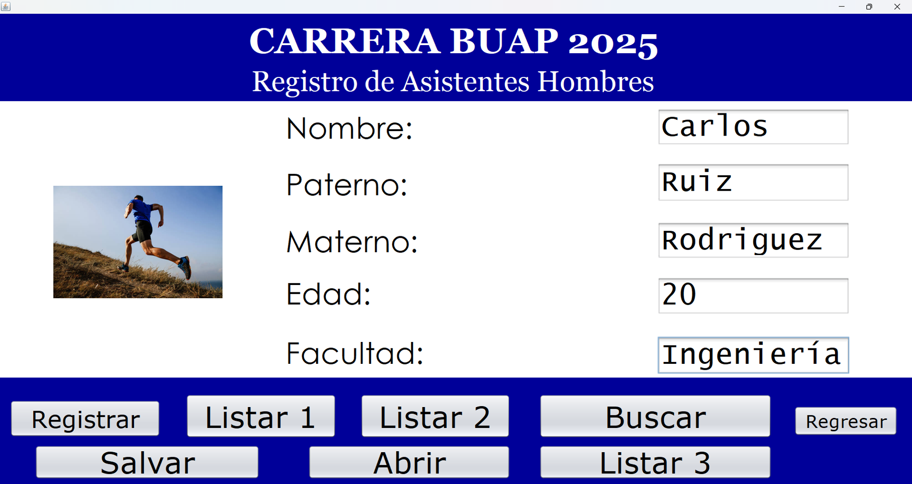

# Sistema de Registro de Participantes

## Descripción
Aplicación de escritorio desarrollada en Java con interfaz gráfica (Swing) para registrar y gestionar participantes en una carrera de una Universidad.

## Tecnologías
- Java
- Swing (JFrame)
- Programación Orientada a Objetos
- Manejo de archivos (.txt)

## Funcionalidades
- Registro de participantes (hombres, mujeres y niños)
- Visualización y búsqueda de registros
- Almacenamiento y carga de datos desde archivos

## Acceso al sistema
Para fines de demostración, el sistema incluye usuarios predefinidos:

- Usuario: Lola | Contraseña: 12  
- Usuario: Emma | Contraseña: 1234  
- Usuario: Laura | Contraseña: 123456  

## Cómo ejecutar
1. Abrir el proyecto en NetBeans
2. Ejecutar la clase principal

## Vista del sistema

### Inicio de sesión
Pantalla inicial para autenticación de usuarios.
![Login](Login.jpe

### Registro de participantes
Formulario para captura y gestión de información de los participantes.

## Autor
Andrik Josué Ruiz Cortés
